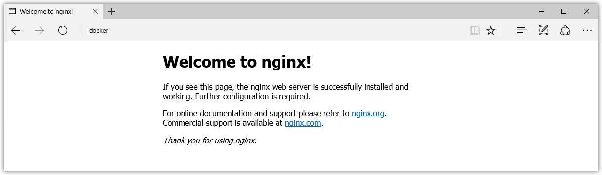
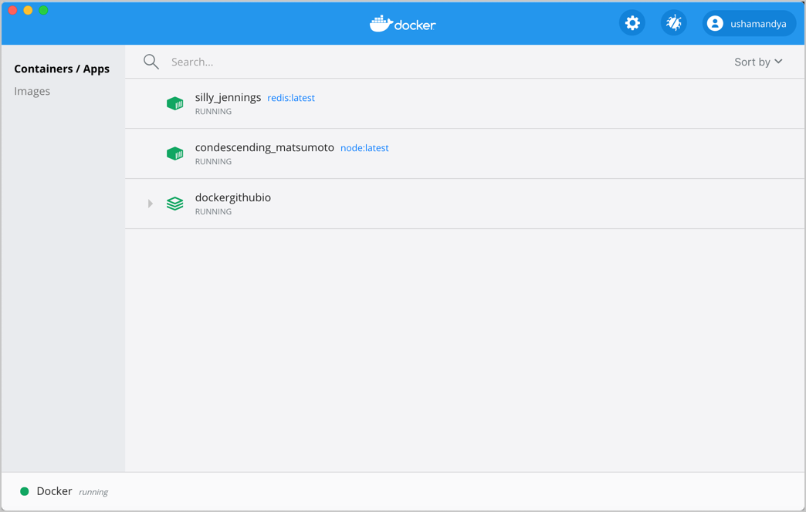
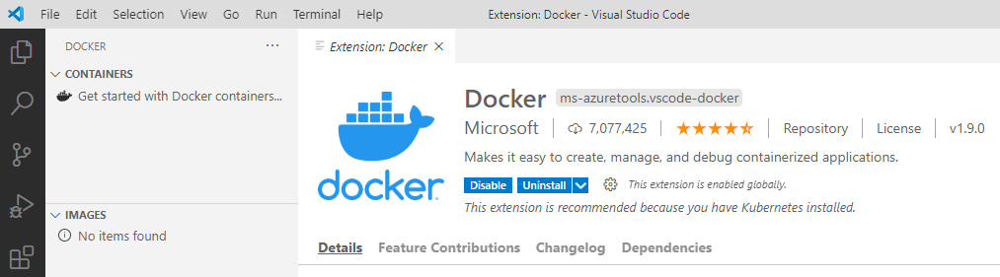

# Lab 01- Introduction to Docker
---

### Lab Steps

- [Step 1: Installation of Docker](#step-1-installation-of-docker)
  - [Installation on Windows 10](#installation-on-windows-10)
    - [Mitigation of the Limit rate constraint imposed by Dockerhub.com](#mitigation-of-the-limit-rate-constraint-imposed-by-dockerhubcom)
  - [Installation on Linux (Ubuntu 18.04)](#installation-on-linux-ubuntu-1804)
- [Step 2: Getting started with Docker](#step-2-getting-started-with-docker)
  - [Test your Docker installation](#test-your-docker-installation)
  - [Starting the "Hello World" container](#starting-the-hello-world-container)
  - [Getting Docker Help](#getting-docker-help)
  - [Exploring a Docker application](#exploring-a-docker-application)
- [Step 4: Visualizing and managing the Containers and the Images](#step-4-visualizing-and-managing-the-containers-and-the-images)
  - [Using The Docker Desktop Dashboard](#using-the-docker-desktop-dashboard)
  - [Using the Docker Extension of VS Code](#using-the-docker-extension-of-vs-code)
- [Step 5: Hello to Podman](#step-5-hello-to-podman)
  - [Install on Podman on Linux CentoS](#install-on-podman-on-linux-centos)
  - [Running a container using Podman](#running-a-container-using-podman)


# Step 1: Installation of Docker 
Docker Engine is an open source containerization technology for building and containerizing your applications. Docker Engine acts as a client-server application with:

- A server with a long-running daemon process dockerd.
- APIs which specify interfaces that programs can use to talk to and instruct the Docker daemon.
- A command line interface (CLI) client docker.

The docker documentation provides [the instructions for installing Docker](https://docs.docker.com/engine/install/) on the different platforms : Mac, Windows, Linux, ..

## Installation on Windows 10

**Docker Desktop for Windows** is the Community version of Docker for Microsoft Windows and MacOS. It requires Windows 10 64-bit: Pro, Enterprise, or Education. Hyper-V and Containers Windows features must be enabled. 

The easy way to install Docker Desktop on Windows 10 is using the Chocolatey package manager. The installation is done using the following command:

```shell
choco install docker-desktop
```

If you have a Windows Home version, you can now install Docker Desktop on it using the [Windows Subsystem for Linux  (WSL 2)](https://docs.microsoft.com/en-us/windows/wsl/install-win10) backend. The detailed instractions are given [here](https://docs.docker.com/docker-for-windows/install-windows-home/).

To verify the installation of Docker on your Windows 10 System, check that you have the **Docker Desktop** shortcut on your desktop, and a little on the windows tray showing that Docker is running. That little icon on the Windows tray serves to configure your Docker.  

### Mitigation of the Limit rate constraint imposed by [Dockerhub.com](https://dockerhub.com)

On November 20, 2020, rate limits for anonymous and free authenticated use of Docker Hub went into effect. Anonymous and Free Docker Hub users are limited to `100` and `200` container image pull requests per `six hours`. 

To mitigate this constraint, there several options:
- **Pay a subscription to Docker Hub**: If you are an individual, or a small team of 2-10 people who just need a space to store images, then paying `$5` to `$7/month` per user is the simplest solution.
- **Mirror Images to your Own Registry**: This option  relies on mirroring or copying images from Docker Hub to your own registry or to another free registry. Tools like _Skopeo_ can help synchronizing images between different container registries. 
- **Proxy to Docker Hub**: This option is like option #2, and serves as an immediate step to overcome the Docker Hub rate limit, despite the similarity the advantage of this option is that there are no replication rules needed. 
There are multiple products which can act like a proxy or 'pull-through cache' for Docker Registries, which is exactly what we need here. Products like [Sonatype Nexus](https://www.sonatype.com/nexus-repository-sonatype), [JFrog Artifactory](https://jfrog.com/artifactory/) can play the role of such proxy.

In your training room, we have implemented the third option. In fact, a **Sonatype Nexus Proxy** has been installed and configured to act as a proxy for Dockerhub.com. Its local IP is `192.168.23.121`. It is serving at port `8181`. Your local docker engine is configured also to use that instance of Nexus proxy.
- From Windows tray, Right-Click on the Docker icon and open the Settings, then `Docker Engine` link. Check the JSON configuration includes the following lines:  

```
  "insecure-registries": [
    "192.168.23.121:8181"
  ],
  "registry-mirrors": [
    "http://192.168.23.121:8181"
  ],
```

## Installation on Linux (Ubuntu 18.04)

- Move to your `C:\DockerTraining-Lab-Workspace` folder. Then CD to `infra-vm-01-ubuntu-with-docker`. This folder contains the `Vagrantfile` for an ubuntu bionic Linux VM and the a bash provisining script named `ubuntu-with-docker.sh`. This script installs and configures the Docker tools for the ubuntu system.
- Run `vagrant up` to launch the vm and SSH into it using the command  `vagrant ssh`. Check that docker is installed by running the following command.
```shell
docker version
```

# Step 2: Getting started with Docker

In this step and the later steps, we will be using the _Windows Docker Desktop engine_.  

## Test your Docker installation

1. Open a terminal window (Command Prompt or PowerShell).
2. Run `docker version` to display the of Docker Client and Engine version:

    ```
    $ docker version
      Cloud integration: 1.0.4
      Version:           20.10.0
      API version:       1.41
      Go version:        go1.13.15
      Git commit:        7287ab3
      Built:             Tue Dec  8 18:55:31 2020
      OS/Arch:           windows/amd64
      Context:           default
      Experimental:      true

      Server: Docker Engine - Community
      Engine:
      Version:          20.10.0
      API version:      1.41 (minimum version 1.12)
      Go version:       go1.13.15
      Git commit:       eeddea2
      Built:            Tue Dec  8 18:58:04 2020
      OS/Arch:          linux/amd64
      Experimental:     false
      containerd:
      Version:          v1.4.3
      GitCommit:        269548fa27e0089a8b8278fc4fc781d7f65a939b
      runc:
      Version:          1.0.0-rc92
      GitCommit:        ff819c7e9184c13b7c2607fe6c30ae19403a7aff
      docker-init:
      Version:          0.19.0
      GitCommit:        de40ad0
    ```
3. Run `docker-compose version` to display the of Docker Client and Engine version:
   ```shell
    $ docker-compose version
      docker-compose version 1.27.4, build 40524192
      docker-py version: 4.3.1
      CPython version: 3.7.4
      OpenSSL version: OpenSSL 1.1.1c  28 May 2019
   ```
    
##  Starting the "Hello World" container

1. Pull the [hello-world image](https://hub.docker.com/r/library/hello-world/) from Docker Hub and run a container:
  ``` shell
   $ docker pull hello-world
   ```
 Start the hello-world container. If the image was not pulled, Docker will pull it before starting the container since the image is required for the container. 

   ``` shell
  $ docker run hello-world

   docker : Unable to find image 'hello-world:latest' locally
   latest: Pulling from library/hello-world
   1b930d010525: Pull complete
   Digest: sha256:c3b4ada4687bbaa170745b3e4dd8ac3f194ca95b2d0518b417fb47e5879d9b5f
   Status: Downloaded newer image for hello-world:latest

   Hello from Docker!
   This message shows that your installation appears to be working correctly.
   ...
   ```

   You notice that the container starts successfully and displays the Hello from Docker! message.

2. List the `hello-world` image that was downloaded from Docker Hub:

   ```shell
   $ docker image ls    # The old form of this command is $docker images
   ```
   Notice that the following command has the same function.
   
   ```shell
   $ docker images
   ```
3. List the `hello-world` container (that exited after displaying "Hello from Docker!"):

   ```shell
   $ docker container ls --all    # The old form of this command is $docker ps --all
   ```
   Notice that the following command has the same function.
   
   ```shell
   $ docker ps
   ```

##  Getting Docker Help

Explore the Docker help pages by running some help commands:
   
   ```shell
   $ docker help

   ```
   Getting help about containers:
   ```   
   $ docker container help
   $ docker container ls help
   $ docker run --help  # This command is the old form of docker container run
   ```
   Getting help about images:
   ```   
   $ docker image --help
   $ docker image ls --help
   $ docker images --help
   ```
## Exploring a Docker application

In this section, we demonstrate the ease and power of Dockerized applications by running something more complex, such as an OS and a webserver.

1. Pull an image of the [Ubuntu OS](https://hub.docker.com/r/_/ubuntu/) and run an interactive terminal inside the spawned container:
   ```shell
    $ docker run --interactive --tty ubuntu bash 
    docker : Unable to find image 'ubuntu:latest' locally
    latest: Pulling from library/ubuntu
    22e816666fd6: Pull complete
    079b6d2a1e53: Pull complete
    11048ebae908: Pull complete
    c58094023a2e: Pull complete
    Digest: sha256:a7b8b7b33e44b123d7f997bd4d3d0a59fafc63e203d17efedf09ff3f6f516152
    Status: Downloaded newer image for ubuntu:latest
   ```
   > Note: The `-interactive`  (also shortened with `-i`) option runs an intercative container and `--tty`  (also shortened with `-t`)attaches a terminal connection to the container.  These two options are usually grouped together in the form of `-it`. Interactive containers keep running as long as the command inside is running. 

2. You are in the container. At the root # prompt, check the hostname of the container:
    ``` shell
    root@8aea0acb7423:/# hostname
    8aea0acb7423
    ```
  Notice that the `hostname` is assigned as the container ID (and is also used in the prompt).

3. Exit the shell with the exit command (which also stops the container):
    ```shell
    root@8aea0acb7423:/# exit 
    ```
4. List containers with the `--all` option (because no containers are running).

   The `hello-world` container (randomly named, `relaxed_sammet`) stopped after displaying its message. The `ubuntu` container (randomly named, `laughing_kowalevski`) stopped when you exited the container.

    ```shell
    $ docker container ls --all

    CONTAINER ID    IMAGE          COMMAND     CREATED          STATUS                      PORTS    NAMES
    8aea0acb7423    ubuntu         "bash"      2 minutes ago    Exited (0) 2 minutes ago             laughing_kowalevski
    45f77eb48e78    hello-world    "/hello"    3 minutes ago    Exited (0) 3 minutes ago             relaxed_sammet
    ```

5. Pull and run a Dockerized [nginx](https://hub.docker.com/_/nginx/) web server that we name, `webserver`:

    ```shell
    $ docker run --detach --publish 8080:80 --name webserver nginx 

    Unable to find image 'nginx:latest' locally
    latest: Pulling from library/nginx

    fdd5d7827f33: Pull complete
    a3ed95caeb02: Pull complete
    716f7a5f3082: Pull complete
    7b10f03a0309: Pull complete
    Digest: sha256:f6a001272d5d324c4c9f3f183e1b69e9e0ff12debeb7a092730d638c33e0de3e
    Status: Downloaded newer image for nginx:latest
    dfe13c68b3b86f01951af617df02be4897184cbf7a8b4d5caf1c3c5bd3fc267f
    ```
   
   The `--detach` option can be shortened by `-d`. The `--publish` option can be shortened by `-p`.
6. Point your web browser at `http://localhost:8080` to display the nginx start page. (You don't need to append `:80` because you specified the default HTTP port in the `docker` command.)



7. List only your running containers:
    ```shell
      $ docker container ls

      CONTAINER ID    IMAGE    COMMAND                   CREATED          STATUS          PORTS                 NAMES
      0e788d8e4dfd    nginx    "nginx -g 'daemon of…"    2 minutes ago    Up 2 minutes    0.0.0.0:8080->80/tcp    webserver
    ``` 

8. Stop the running nginx container by the name we assigned it, webserver:
    ```shell
    $  docker container stop webserver
    ```

9. Remove all three containers by their names. Note that the latter two names will differ for you:

   ```shell
   $ docker container rm webserver laughing_kowalevski relaxed_sammet
   ```

# Step 4: Visualizing and managing the Containers and the Images

## Using The Docker Desktop Dashboard
Recently docker Desktop included a Dashbord that provides a simple interface that enables you to manage your containers, applications, and images directly from your machine without having to use the CLI to perform core actions.  

From the Docker menu, in the windows tray, select Dashboard. This lists all your running containers and applications. You must have running or stopped containers and applications to see them listed on the Docker Dashboard.


## Using the Docker Extension of VS Code
The Docker extension of VS Code makes it easy to build, manage, and deploy containerized applications.
To install the extension, open the Extensions view from the left sidebar, search for docker to filter results and select Docker extension authored by Microsoft.

The Docker extension contributes a Docker Explorer view to VS Code. The Docker Explorer lets you examine and manage Docker assets: containers, images, volumes, networks, and container registries. If the Azure Account extension is installed, you can browse your Azure Container Registries as well.

The right-click menu provides access to commonly used commands for each type of asset.


# Step 5: Hello to Podman
Podman is a daemonless container engine for developing, managing, and running Open Container Initiative (OCI) containers and container images on your Linux System. Podman provides a Docker-compatible command line front end that can simply alias the Docker CLI:

## Install on Podman on Linux CentoS
- Move to your `C:\DockerTraining-Lab-Workspace` folder. Then CD to `infra-vm-02-centos-with-podman`. This folder contains the `Vagrantfile` for an ubuntu bionic Linux VM and the a bash provisining script named `centos-8-with-podman.sh`. This script installs and configures the Podman tools for the centos/8 system.
- Run `vagrant up` to lauch the vm and SSH into it using the command  `vagrant ssh`. Check that docker is installed by running the following command.
```shell
sudo podman version
sudo podman --help
```

## Running a container using Podman
Let's try to run the `hello-world` container 
```shell
sudo podman run hello-world
```
As you can see Podman downloaded this image from DockerHub.
If you want to check your images:
```shell
sudo podman image ls -a
```
You could see your containers:
```
sudo podman ps -a
```
- We can now define an alias named docker for podman
```shell
alias docker=podman
```
