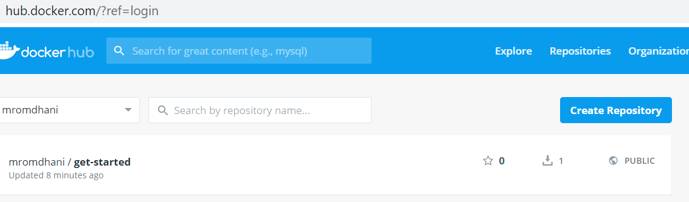
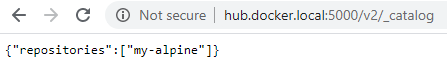
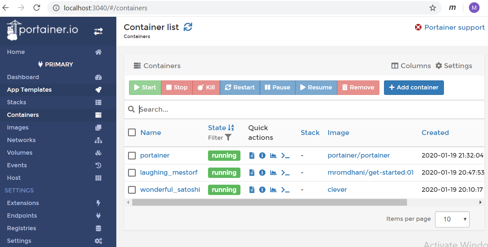

# Lab 02- Working with Docker Images and Containers
---


### Lab Steps
- [Step 1: Working with images](#step-1-working-with-images)
  - [Finding and retrieving images from DockerHub](#finding-and-retrieving-images-from-dockerhub)
  - [Listing and inspecting images](#listing-and-inspecting-images)
  - [Creating a new image from a container](#creating-a-new-image-from-a-container)
  - [Tagging an image](#tagging-an-image)
  - [Saving and loading Docker images](#saving-and-loading-docker-images)
- [Step 2: Working with containers](#step-2-working-with-containers)
  - [Running containers](#running-containers)
  - [Running a container in interactive mode](#running-a-container-in-interactive-mode)
  - [Listing and inspecting containers](#listing-and-inspecting-containers)
  - [Stopping and starting containers](#stopping-and-starting-containers)
  - [Interacting with containers](#interacting-with-containers)
  - [Remove all stopped containers](#remove-all-stopped-containers)
- [Step 3 : Deploy a Docker Image](#step-3--deploy-a-docker-image)
  - [Deployment to Docker Hub](#deployment-to-docker-hub)
  - [Creation of a private Docker registry](#creation-of-a-private-docker-registry)
      - [Create portainer container](#create-portainer-container)
        - [With No Auth](#with-no-auth)
        - [With Auth](#with-auth)
    - [To remove and revert all changes](#to-remove-and-revert-all-changes)


# Step 1: Working with images
 
## Finding and retrieving images from DockerHub
Docker Hub is a registry service on the cloud that allows you to download Docker images that are built by other communities. The base images were created by the docker team. You can also upload your own Docker built images to Docker hub.  Docker Hub can be accessed here: https://hub.docker.com/explore/. There are two different types of images: (i) official images, and (ii) personal images.

To find a public image on Docker hub, you can use either using the web interface or using the command line.
- Search for `alpine` images having at least 200 stars using the following command:
    ```shell
    $ docker search --filter stars=200 alpine  # The old form of the stars filter is --stars=200
    ```
- Search for `alpine` images having at least 200 stars and are official builds using the following command:
    ```shell
    $ docker search --filter is-official=true --filter stars=200 alpine
    ```
     > Note: Alpine is a small, secure Linux distribution. It is of about 5 MB. BusyBox distribution is smaller than Alpine. It is of about 2 MB. Ubuntu image is weights about 60 MB.

- Pull the latest version of the `alpine` image down to our local repository, using the docker
pull command: 
    ```shell
    $ docker pull alpine
    ```
- Pull the latest version of the `ubuntu` image down to our local repository, using the following docker pull command: 
    ```shell
    $ docker pull ubuntu
    ``` 
- **Question:** How many layers in `alpine` and ubuntu `images` ? Hint the docker `history` command as follows:
    ```shell
    $ docker history alpine
    ```
    > Note: The `<missing>` value in the IMAGE field for all but one of the layers of the image, is misleading. It is not considered an error and you can ignore it. The `<missing>` line is because this part of the image history was built remotely and the cached intermediate images are not on the local docker host.


## Listing and inspecting images
To see the list of Docker images on the system, you can issue the following command. This command has two forms : a long form and a short form. The long form is the following: 

```shell
    $ docker image ls   # The long form
```

```shell    
    $ docker images # The short form
```
The result looks like this. The listing displays the image name, its tag, its ID, its creation date and size.

  ```shell
    REPOSITORY        TAG            IMAGE ID           CREATED            SIZE
    nginx             latest         ed21b7a8aee9       10 days ago        127MB
    alpine            latest         a187dde48cd2       2 weeks ago        5.6MB
    ubuntu            latest         4e5021d210f6       2 weeks ago        64.2MB
    hello-world       latest         fce289e99eb9       15 months ago      1.84kB
  ``` 
  > Note: Docker 1.13+ introduced grouped commands (aka long form commands) to help organize a bunch of Docker commands. If you run docker help and are using Docker 1.13+ (2017), you will see both "Management Commands" and "Commands" in the help text. Short form commands are considered as a legacy syntax.
```
            Management Commands:
            ...
            image       Manage images
            container   Manage containers 
            ...
            Commands:
            ...
            ls          List images
            run         Run a command in a new container
            ...
```
- Pratice [filtering images](https://docs.docker.com/engine/reference/commandline/images/#filtering) by criteria using the `--filter` (or `-f`) option. Filter for example **dangling** images. Dangling images are untagged images that have no relationship to any tagged images. 
```shell
   $ docker images --filter "dangling=true"
```
- Pratice  formatting the output using the `--format` option. Display for example the image name, tag, and size.
```shell
  $ docker images --format "{{.Repository}}: {{.Tag}}: {{.Size}}"
```
- **Question:** Compare the size of the `alpine` and `ubuntu` images.

**Inspecting Docker images**

Docker `inspect` provides detailed information on images and other constructs controlled by Docker (containers, networks, ... ). By default, docker inspect will render results in a JSON array.
- Inspect the `nginx` image using the following command
```shell
  $ docker inspect nginx
```
The output can be overwhelming. Therefore, there is a handy option to filter certain information.
- Filter the tags and hash of the nginx image using `--format` (or `-f`) option.
```shell
  $ docker  inspect -f "{{.RepoTags}} {{.Config.Image}} " nginx
```
- Filter the tags and hash of the nginx image using the [jq](https://stedolan.github.io/jq/) utility. jq is like sed for JSON data - you can use it to slice and filter and map and transform structured data with the same ease that sed, awk, grep and friends let you play with text. An excellent tutorial on jq can be found [here](https://stedolan.github.io/jq/tutorial/).
  - Download jq for Windows 64-bit from [here](https://stedolan.github.io/jq/download/).
  - Rename the downloaded executable as `jq.exe`. Copy it into some location in your filesystem and add that location to your system `PATH`.
```shell
  $  docker inspect nginx | jq ".[]| (.RepoTags, .Config.Image)"
``` 

**Removing Docker images**

Images can be removed by `docker image rm` command or its short form `docker rmi` command.
- Try to remove the Alpine image using the following command
```shell
$ docker rmi alpine
```
You can specify the complete `RepoTag` of the image i.e: `alpine:latest`. 
```shell
$ docker rmi alpine:latest
```
    > Note: If you get an error similar to the one shown below, it means that an existing container uses the image. To remove the image, you will have to remove the container first.
```shell
    Error response from daemon: conflict: unable to remove repository reference ... 
```

**Removing Dangling images**

Dangling images are safe to delete. As mentionned earlier, they do not have a tag and they are not referenced by other images. So, they no longer serve a purpose and consume disk space.
You can delete dangling images on their own by running the following command:
```shell
$ docker rmi -f $(docker images -f "dangling=true" -q)
```
Docker provides also a `docker image prune` command that can be used to remove images. Without any additional argument, `docker image prune` removes dangling images type:

```shell
$ docker image prune  # Removes dangling images
```
You'll be prompted to continue, use the `-f` or `--force` flag to bypass the prompt.

To remove **dangling images** and **unused images** use the prune command with the `-a` flag. Unused images are images which are not referenced by any container.

```shell
$ docker image prune -a # Removes dangling images and unused images
```
## Creating a new image from a container
You can save the current state of a container as a new image by using the "`docker commit`" command. This is useful if you have modified a container and want to commit the changes to a new image for later use. 

Let's  to create a new image from the default alpine image in which we will add the `curl` tool.
- Start a container with the the default `alpine` latest image.
```shell
$ docker run -it -d --name my-alpine alpine
```
- Check that the default container does not contain the `curl` command.
```shell
$ docker exec my-alpine curl -s ifconfig.me
```
- Install `curl` in the running container.
```shell
$ docker exec my-alpine sh -c "apk update; apk add curl"
```
- Check if curl works correctly.
```shell
$ docker exec my-alpine curl -s ifconfig.me
```
- Commit the modified image in a new image named `my-alpine-with-curl`.
```shell
$ docker commit my-alpine my-alpine-with-curl
```
- Start a new container named `my-new-alpine-container` with the committed image.
```shell
$ docker run -it -d --name my-new-alpine-container my-alpine-with-curl
```
- We can now use `curl` from the comitted image.
```shell
$ docker exec my-new-alpine-container curl -s ifconfig.me
```

## Tagging an image

 Docker tags convey useful information about a specific image version/variant. A good analogy is how Git tags refer to a particular commit in your history. 
 You can can tag an image through the tag command.

```shell
$ docker tag SOURCE_IMAGE[:TAG] TARGET_IMAGE[:TAG]
```
This command just creates an alias (a reference) by the name of the `TARGET_IMAGE` that refers to the `SOURCE_IMAGE`. That's all it does. It's like assigning an existing image another name to refer to it. Notice how the tag is specified as optional here as well, by the `[:TAG]`.
   
   > Note: Whenever an image is tagged without an explicit tag, it's given the `latest` tag by default. It's an unfortunate naming choice that causes a lot of confusion. But I like to think of it as the default tag that's given to images when you don’t specify one.

- Let's tag the `my-alpine-with-curl` as version 1. The command is as follows:
```shell
$ docker tag my-alpine-with-curl my-alpine-with-curl:1
```
- If you are going to push an image to a Docker Hub repository, the tag shoud be prefixed with the Docker Hub username of the user owning the repository.
```
$ docker tag my-alpine-with-curl mromdhani/my-alpine-with-curl:2
```

**Question** : How to remove an image Tag ? does it remove the image also ?

## Saving and loading Docker images
If you simply need to move an image from one host to the other, as is the case with sharing an image with someone in the office, you can achieve  this using a save/load process. This is similar to pushing and pulling from a repository but without the overhead of uploading and downloading the image.The documentation describes save and load as follows (The command given below in in PowerShell):
```shell
$ docker help | findstr "save load"
  load        Load an image from a tar archive or STDIN
  save        Save one or more images to a tar archive (streamed to STDOUT by default)
```
Let's save an example of image and inspect its contents :
```shell
$ docker save my-alpine-with-curl:latest -o alpine-saved.tar
```
The tar file contains a backup of the image and its dependent layers. Let's explore its content. 
```shell
$ mkdir alpine-saved ; tar -xf alpine-saved.tar -C alpine-saved
$ tree /F alpine-saved
Folder PATH listing for volume Windows
Volume serial number is BA65-3623
C:\USERS\M.ROMDHANI\ALPINE-SAVED
│   3405d8ab7e88a5fd5f592c94fed1573dfcdd6552580ed94d93ac3722300f7c48.json
│   manifest.json
│   repositories
│
├───906210bc0a3eaaba7ebb7ec622be1a6e8a40c503c007ed07c6ad0eb6cce75e9b
│       json
│       layer.tar
│       VERSION
│
└───fa4b5b9a709a811f38e10545ee1eddc93c20d7159733783fb699ef1a4d047a6f
        json
        layer.tar
        VERSION
```
To load an existing image, we use the load command.
Let's delete the existing image and recreate it using a docker load.
```shell
$ docker rmi  my-alpine-with-curl:latest  # Remove the existing image 
$ docker images | findstr "my-alpine-with-curl"   # Check if it is removed really
$ docker load -i  alpine-saved.tar    # Recreate the image using Docker load
$ docker images | findstr "my-alpine-with-curl" # Check if the image is there
```

# Step 2: Working with containers
Docker runs processes in isolated containers. A container is a process which runs on a host. The host may be local or remote. In this step, we will learn how to run, to stop, to remove containers.

## Running containers
Running of containers is managed with the Docker run command. The basic docker run command takes this form:

```shell
$ docker container run [OPTIONS] IMAGE[:TAG|@DIGEST] [COMMAND] [ARG...]
```
The docker run command must specify an IMAGE to derive the container from. You can get more details on options [here](https://docs.docker.com/engine/reference/run/).
To run a container , first launch the Docker container.

```shell
$ docker container run ubuntu echo "hello from container !"
Unable to find image 'ubuntu:latest' locally
latest: Pulling from library/ubuntu
5c939e3a4d10: Pull complete
c63719cdbe7a: Pull complete
... 
Digest: sha256:8d31dad0c58f552e890d68bbfb735588b6b820a46e459672d96e585871acc110
Status: Downloaded newer image for ubuntu:latest
hello from container !
```
We created and executed our container, but since it did not find the ubunto image locally, it downloaded it by itself (without having to use docker image pull). Then it has executed the command we placed with him, namely to write "hello from container !". And it's all, since the echo is finished, he turned off the container. We will now check if this container is started or not, to do this we will use docker container ls:

```shell
$ docker container ls   
CONTAINER ID        IMAGE       COMMAND          CREATED          STATUS          PORTS       NAMES
```
We don't see any container. If we add the -a option we can see all the containers.
```shell
$ docker container ls -a 
CONTAINER ID       IMAGE       COMMAND            CREATED          STATUS           PORTS         NAMES
ae198d73aafc       ubuntu     "echo 'hello ..."   4 minutes ago     Exited (0) 4 minutes ago   pedantic_snyder 
```
Here it is, small explanation of this table:

- _CONTAINER ID_: Container ID, generated so that it is unique
- _IMAGE_: The image used for this container
- _COMMAND_: The command executed
- _CREATED_: Time since container creation
- _STATUS_: The current status of the container, here exited with a return code 0 (without error) for 4 minutes
- _PORTS_: List of listened ports (we will see this later)
- _NAMES_: Name of the container, here it is a random name because we have not defined one to our container

**Naming a container**

If no name is specified Docker will automatically generate a name. Docker's default container names are something along the lines of `<adjective>_<scientist or engineer>` which is cute and memorable (See the go generation script ant the list of names here: https://github.com/moby/moby/blob/master/pkg/namesgenerator/names-generator.go). 

You can use `--name` option  to specify a container name.
```shell
$ docker container run --name my-ubuntu ubuntu echo "hello from container !"
```
**Passing parameters to a container**

To pass environment variables to a container, you can use the `--env` or its short form  `-e` option. In the following example, we pass environment variable `MYSQL_ROOT_PASSWORD`.
```shell
$ docker run --name my-mysql -e MYSQL_ROOT_PASSWORD=my-secret-pw -d mysql:latest
```
An alternative solution is to use a text file to store our variables, using the standard `key=value` format.
Let's create a file named `my-env.txt` and itilialize it with the following content.
```shell
MYSQL_ROOT_PASSWORD=my-secret-pw
```
```shell
$ docker run --name my-mysql --env-file my-env.txt -d mysql:latest
```
## Running a container in interactive mode

The advantage of Docker interactive mode is that it allows us to execute commands at the time of running the container. As a result, running a container in interactive mode can be a useful tool in the arsenal of a developer. 
Basically, by using the `-it `flag, we attach the STDIN channel to our terminal as well as the STDOUT to the terminal. 

```shell
$ docker run –it --name my-ubuntu ubuntu /bin/bash 
```
- _-i (interactive)_ is about whether to keep STDIN open (some programs, like bash, use stdin and other programs don't).

- _-t allocates a pseudo-tty_. is for STDOUT and STDERR. The -t flag is responsible for displaying the output in a pretty format.

**What is the detached mode ?**
Detached mode, shown by the option `--detach` or `-d`, means that a Docker container runs in the background of your terminal. It does not receive input or display output.

```shell
$ docker run -it -d ubuntu
```
If you run containers in the background, you can find out their details using `docker container ls` (or `docker ps`) and then reattach your terminal to its input and output.

## Listing and inspecting containers

As mentionned earlier,  we use docker `container ls` command (or its short form `docker ps`) to list the runing containers.
```
$ docker container ls -a
```
or 
```
$ docker ps -a
```

To inspect a container, use the inspect command as shown in the following command.

```
$ docker inspect my-ubuntu    # You can provide the container ID as an argument 
```
Output will be in JSON format.
You can filter specific properties from the JSON using `--format` option or using the `jq` tool.

```shell
$ docker inspect --format '{{ .NetworkSettings.IPAddress }}' my-ubuntu
```
```shell
$ docker inspect  my-ubuntu  | jq -r .[0] | jq .Config.Cmd
```
## Stopping and starting containers

- To stop a running container, use the `stop` command.
```shell
$ docker stop my-ubuntu
```
- to start a stopped Container, use the `start` command.
```shell
$ docker start my-ubuntu
```
To pause a running container, use the `pause` command.  To resume a container, use the `unpause` command.

> Note: **Stop** vs **Pause**
     The  docker pause command freezes all processes in the specified containers. Docker stop terminates all the processesof the container.

## Interacting with containers

- Let's start a new container in **detached mode**.
```shell
$ docker run -it -d --name my-ubuntu2 ubuntu
```
- To enter the shell of that running container we can use the `docker attach` command: 
```shell
$ docker attach my-ubuntu2
```
A running container can be detached with `^P^Q` from its shell and reattached with `docker attach`.

- We can also use the `docker exec` command to run `bash` shell on the container and start interacting with that shell.
```shell
$ docker exec -it my-ubuntu2 /bin/bash
```
- To get the logs of a container Run the `docker logs` commands to 
```shell
$ docker logs my-ubuntu2
```  
- To view only the tail of the logs
To avoid being spammed with many pages of output, we can use the `--tail` option:
```shell
$ docker logs --tail 10 my-ubuntu2  # displays the last 10 lines
```
- To follow the logs in real time
Just like with the standard UNIX command `tail -f`, we can follow the logs of our container:
```
$ docker logs --tail 1 --follow my-ubuntu2
```
This will display the last line in the log file.
Then, it will continue to display the logs in real time.
Use ^C to exit.


## Remove all stopped containers
Before performing the removal command, you can get a list of all non-running (stopped) containers that will be removed using the following command:

```shell
$ docker container ls -a --filter status=exited --filter status=created 
```
- To remove all stopped containers use the docker container `docker container rm` command:
```shell
$ docker container rm $(docker container ls --filter status=exited -aq)
```
- To remove docker containers by Image Nam which are stopped, we will use following command. It will delete all the stopped containers of image alpine.
```shell
$ docker rm $(docker ps -a --filter="ancestor=alpine" --filter "status=exited")
```
- You can use also the `docker container prune` command to remove all stopped containers:
```shell
$ docker container prune
```
You'll be prompted to continue, use the `-f` or `--force` flag to bypass the prompt.

# Step 3 : Deploy a Docker Image

In this step, we will be pushing our built image to the registry so that we can use it anywhere. The Docker CLI uses Docker’s public registry by default.

## Deployment to Docker Hub

- Log into the Docker public (Docker Hub) registry from your local machine.
```shell
$ docker login
```
- **Tag the image**: It is more like naming the version of the image. It's optional but it is recommended as it helps in maintaining the version(same like ubuntu:16.04 and ubuntu:17.04)

- Create quickly a local image named `my-web-app`. You can run for example an nginx container. Then commit it in my-webapp using `docker commit [id] my-web-app`. 
```shell
$ docker tag my-web-app mromdhani/get-started:01
```
- Publish the image: Upload your tagged image to the repository: Once complete, the results of this upload are publicly available. If you log into Docker Hub, you will see the new image there, with its pull command.
```shell
$ docker push  mromdhani/get-started:01
```
That's it, you are done. Now you can go to Docker hub and can check about it also. You published your first image.


```shell
>docker push  mromdhani/get-started:01
The push refers to repository [docker.io/mromdhani/get-started]
aebb2652aa30: Pushed 
7cdbefd28fe4: Pushed
8aa41c245e90: Pushed
668c0ea1e1a4: Pushed
f55aa0bd26b8: Mounted from library/ubuntu
1d0dfb259f6a: Mounted from library/ubuntu
21ec61b65b20: Mounted from library/ubuntu
43c67172d1d1: Mounted from library/ubuntu 
01: digest: sha256:071da23f585371e8c315b3e056103074e4e7d3e12f80348a00c9a4df7efd6120 size: 1985
```

## Creation of a private Docker registry
Docker hub (hub.docker.com) is the primary source for the public images.  DockerHub only allows 1 private image to be stored in the Free plan, 5 images for 7$ and 10 for 12$ which is decent price for production projects, but for personal hobby projects may be a lot.

You can have a 5$ server on DigitalOcean for personal needs, which you want also to use as a docker registry, and CI for my private projects.

There are a few reasons setting up a loal docker registry :

- Total control of our registry and repositories
- We need to set up a local network and to easily distribute images throughout it, to save the bandwidth
- We have a closed network without internet access
- Setting up a local CI build server that uses that registry
- We don't want to pay some crazy plans to cloud providers to host our repositories
Follow the steps below to create your private Docker registry:

###Steps
- Create a directory to permanently store images.
    - Navigate to `C:\ drive` and create a folder with the name of localhub (mkdir localhub). For Linux, create the same folder under `/home`.
        ```shell
            mkdir localhub 
        ```
    - Navigate to `C:\localhub` folder in windows or `/home/localhub` in Linux and create a subfolder with the name of "`registry`".
        ```shell
            cd localhub 
            mkdir registry 
        ```
- Pull the registry image from DockerHub.
    - Type the following command (Windows/Linux)to pull the registry image from the docker hub:
      
        ```shell
        docker pull registry
        ```
- (_This step is optional_)
   Before going to the docker registry set up, I want to set up a _meaningful local domain name for your private registry instead of using localhost_ but this step is completely optional. I prefer to have the local domain as `hub.docker.local`. To configure the local domain in windows and Linux, do the following steps:
    - Windows:
Open an elevated Notepad in docker host.
Open the `C:\Windows\System32\drivers\etc\hosts` file in the Notepad and add this `127.0.0.1 hub.docker.local`as an entry in it.
Save and close the file.
   
 - Linux:
Open a terminal in docker host and type `nano /etc/hosts` or `vi /etc/hosts`
Add this `127.0.0.1 hub.docker.local` as an entry in it.
Save and close the file.
- Spin up a container with the docker registry image
    ``` shell
    Windows: 
    docker run -d -p 5000:5000 -v C:/localhub/registry:/var/lib/registry --restart=always --name hub.local registry
    Linux:
    docker run -d -p 5000:5000 -v /home/localhub/registry:/var/lib/registry --restart=always --name hub.local registry 
    ```

    _Docker registry uses the **5000 port as default**. `--restart=always` flag is enable the auto start after the docker restarted. `-v` will bind the given host folder with container file system.
    Docker might ask you for the user name and password to share the localhub folder with container if you have not setup the share folder already in docker._
    
    Ensure the registry container is up and running:
    ```shell
    $docker ps  # or docker container ls
    ```
- The next step is to prepare the docker image and push to our private registry. You can use any one of the existing images to quickly understand the concepts of the Docker Registry. Alpine is one of the lite weight Linux distribution(~5MB) so you can use this image for a quick assessment:
  ```shell
   docker pull alpine
    ```
- Create a tag to alpine Linux with `hub.docker.local:5000/my-alpine`
    ```shell
    docker tag alpine hub.docker.local:5000/my-alpine
    ```
    This creates an additional tag on an existing alpine image. Tag format will be like `registry hostname: port/new name`. Docker will extract the location from the given tag while pushing to your private registry.
- Push the my-alpine image to your private registry:
  
    ```shell
    docker push hub.docker.local:5000/my-alpine
    ```
- Remove the alpine and its tagged version to ensure docker is pulling the image from your private registry instead of docker hub.

    ```shell
    docker rmi hub.docker.local:5000/my-alpine 
    docker rmi alpine
    ```
- Now, pull the `my-alpine` image from your private registry
   ```shell
   docker pull hub.docker.local:5000/my-alpine
    ```
- Spin up a container with newly downloaded image and ask the container to list out its root directory.
   ```shell
     docker run hub.docker.local:5000/my-alpine ls
    ```
- You can check registry catalog on this http://hub.docker.local:5000/v2/_catalog address.

   

- (Optional)Stop and remove the registry container and image 
    ```shell
    docker container stop hub.local
    docker container rm hub.local 
    ```
- (Optional)Finally, remove the my-alpine image as well.
    ```shell
    docker ps -a
    docker container rm container_id
    docker rmi hub.docker.local:5000/my-alpine
    ```

# Step 4. Managing Docker Containers using Portainer 

[Portainer](https://www.portainer.io/) is a lightweight management UI which allows you to easily manage your different Docker environments (Docker hosts or Swarm clusters). Portainer is meant to be as simple to deploy as it is to use. It consists of a single container that can run on any Docker engine (can be deployed as Linux container or a Windows native container, supports other platforms too). There are other UI tools for Docker such as [Kitematic](https://kitematic.com/), [Shipyard](https://shipyard-project.com/), [Rancher](https://rancher.com/), ...

## Installing Portainer on Windows 10

This setup will let you run [Portainer](https://www.portainer.io/) on windows by using the [docker.for.win.localhost](https://docs.docker.com/docker-for-windows/networking/) endpoint.

Please note:

* This will expose your docker API, without TLS, publicly from your machine.
* For more advanced config see the [portainer docs](https://portainer.readthedocs.io/en/latest/deployment.html).

### Task 1 - Enable docker without TLS

Docker settings -> General -> Expose docker daemon on tcp://...

### Task 2 - Run Portainer Image

The only trick here is to use this endpoint: `tcp://docker.for.win.localhost:2375`.

#### Create portainer volume

Powsershell (admin):

```ps
docker volume create portainer_data
```

#### Create portainer container

##### With No Auth

```ps
docker run -d -p 3040:9000 --name portainer --restart=always -v portainer_data:/data portainer/portainer --no-auth -H tcp://docker.for.win.localhost:2375
```

##### With Auth

```ps
docker run -d -p 3040:9000 --name portainer --restart=always -v portainer_data:/data portainer/portainer -H tcp://docker.for.win.localhost:2375
```
Open your browse and open this link: <http://localhost:3040>


### To remove and revert all changes

Powershell (admin):

```ps
docker stop portainer

docker rm portainer

docker rmi portainer/portainer

docker volume rm portainer_data
```