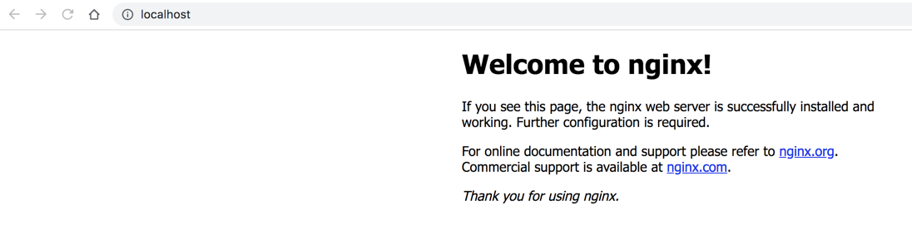
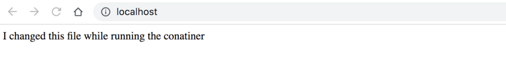

# Sharing volumes
---
By default all files created inside a container are stored on a writable container layer. This means that the data doesn't persist when that container no longer exists, and it can be difficult to get the data out of the container if another process needs it.

Docker has two options for containers to store files in the host machine, so that the files are persisted even after the container stops: _volumes_, and _bind mounts_. If you’re running Docker on Linux you can also use a `tmpfs` mount. If you're running Docker on Windows you can also use a named pipe.
An easy way to visualize the difference among `volumes`, `bind mounts`, and `tmpfs` mounts is to think about where the data lives on the Docker host.


1. **Volumes** are stored in a part of the host filesystem which is managed by Docker (/var/lib/docker/volumes/ on Linux). Non-Docker processes should not modify this part of the filesystem. Volumes are the best way to persist data in Docker.

2. **Bind mounts** may be stored anywhere on the host system. They may even be important system files or directories. Non-Docker processes on the Docker host or a Docker container can modify them at any time.

3. **tmpfs mounts** are stored in the host system’s memory only, and are never written to the host system’s filesystem


A Docker volume is a directory (or collection of files) that lives on the host file system and is not a part of the container's UFS. It is within these volumes that containers are capable of saving data. With the docker volume command, you can easily manage volumes to expand your containers well beyond their basic capability.

Let's find out how to deploy a new container that includes a volume attached to a specific directory on a host such that the container will stay in sync with the data in the volume. 

## Understanding tmpfs mounts
Let’s pull the latest nginx image from the docker hub and run the container and load the home page which listens on port 80.
```shell
// pull the nginx image
$ docker pull nginx
// run the container
$ docker run -it --name=webApp -d -p 8080:80 nginx
```
Browse <localhost:8080>

Let's use the docker exec command to edit the welcome page and load it.
```shell
// exec command
docker exec -it webApp bash
// cd to welcome page and edit it
cd /usr/share/nginx/html
echo "I changed this file while running the conatiner" > index.html
```
Browse <localhost:8080>


Let's stop  the container and start it again. We can still see the changes that we made. 
```shell
docker stop webApp
docker start webApp
```
Browse <localhost:8080>

But, if we stop and remove this container and start another one and load the page, there is no way that we could access the file that we have changed in another container.

```shell
docker stop webApp
docker remove webApp
docker run -it --name=webApp -d -p 8080:80 nginx
```
Browse <localhost:8080>


## Working with Data Volumes
The syntax to create a docker volume is:
```shell
docker volume create <volume_name>
```
Example:

```shell
$ docker volume create devops_volume
```
The above command will create a docker volume named `devops_volume`.

### Listing docker volumes
To list all created docker volumes, run:

```shell
$ docker volume ls
```
### Inspecting docker volumes
The `docker volume inspect` command will give you the details about creation of the volume, location, name and scope.
```shell
$ docker volume inspect devops_volume
```
### Creating containers with the volume attached to them
```shell
$ docker container create --name myBusyBox1 -it --mount source=devops_volume,target=/app busybox
```
To verify if the container has been created or not, use `docker ps -a` command. To start the newly created container, for example myBusyBox1, run:
```shell
$ docker container start myBusyBox1
```
#### Copying files between containers from a shared volume
Let's create a scenario in which we will create the file in one container at the shared location and we will try to access the file from another container.

We already have created a container named myBusyBox1. Let us created another one, for example myBusyBox2.

```shell
$ docker container run --name myBusyBox2 -dit --mount source=devops_volume,target=/app busybox
```
Now we have two containers in running state, myBusyBox1 and myBusyBox2.

Let us connect to the first container and create a file inside the /app folder.
```shell
$ docker exec -it myBusyBox1 sh
```
Then, create a new folder called devops inside /app folder and exit from the first container.
```shell
$  cd /app
$  mkdir devops
```
Now, use the following command to copy a file, for example `index.html` from local system (create it using `touch index.html` for example) to in the location `/app/devops/` of the `myBusyBox1` container.
```shell
docker container cp index.html myBusyBox1:/app/devops
```
Now connect to another second container i.e myBusyBox2 and verify that inside `/app/devops` folder the `index.html` file is present or not.
```
$ docker exec -it myBusyBox2 sh
```
Navigate to `/app/devops`; then you will see `index.html` file.

We can check the Mountpoint location of the volume using docker volume inspect command like below:
```shell 
$ docker volume inspect devops_volume
```
You will see that the mountpoint location is `/var/lib/docker/volumes/devops_volume/_data`.

### Delete docker volumes
The syntax to delete a volume is:
```shell
$ docker volume rm <volume_name>
```
Let us delete the volume called devops_volume.
```shell
$ docker volume rm devops_volume
```
In above screenshot, we are trying to delete the volume but not able to delete because the volume is already in use. So firstly we need to kill the container and make volume free. And then we can delete the volume.

To do so, first remove all running containers using command:
```shell
$ docker rm –f $(docker ps -aq)
```
And then remove the volume: 
```shell
$ docker volume rm devops_volume
```
**Delete all volumes at once**
If we have multiple volumes and want to delete all volumes then we have to use `docker prune` command.
```shell
$ docker volume create volume1
$ docker volume create volume2
$ docker volume create volume3
$ docker volume ls
$ docker volume prune
```

## Working with Host Data Volume (Bind mounts)
The first step is to create a new directory to house the volume. To do this, open a terminal window and issue the command:

```shell
$ mkdir C:\tmp_docker
$ cd tmp_docker
$ mkdir container-data
```
You must ensure the newly-created directory is housed in a location the Docker user can access (with read-write privilege).

Once you've created that directory, you're ready to mount a volume inside. Let's say you're going to deploy a container, based on the official Ubuntu image, that contains a directory called /data. To deploy such a container that attaches the internal /data directory to a volume within the host directory ~/container-data, you would issue the command:

```shell
$ docker run -dit -P --name ubuntu-test -v C:\tmp_docker\container-data:/data ubuntu:18.04
```
The above command breaks down like this:

docker run is the main command that says we’re going to run a command in a new container.
- _-dit_ is d for detached mode, and it ensures that bash or sh can be allocated to a pseudo terminal.
- _-P_ publishes the containers ports to the host.
- _–name_ says what follows is the name of the new container.
- _-v_ says what follows is to be the volume.
ubuntu:18.04 is the image to be used for the container.
Make sure to remember the first  characters of that ID, as you'll need it to gain access to the container bash prompt.
Access the newly-deployed container with the command:
```shell
$ docker attach 5cdea
```
Issue the command `ls / `and you will see the `/data` directory added to the Ubuntu container. Let's create a test file in that directory with the command:

```shell
$touch /data/test
```
After creating this test file, open another terminal window on the host machine and issue the command dir `C:\tmp_docker\container-data`. You should see the test file within that directory.

# Database Volumes
Let's say you want to create a volume for a database. You can do this by first deploying a MySQL database Docker container and instructing it to use a persistent storage volume named mysql-data. Do this with the command:

```shell
$ mkdir C:/tm_docker/mysql-data
$ docker run --name mysql-test -v c:/tm_docker/mysql-data:/var/lib/mysql -e MYSQL_ROOT_PASSWORD=passwd -d mysql:latest
```
In the above command, the -e switch informs docker what follows is an environment variable.

Access the bash prompt for the container with the command:

```shell
$ docker exec -it ID /bin/bash
```
Where ID is the first four characters of the ID of the newly deployed container.

List out the contents of the container’s /var/lib/mysql directory with the command:

```shell
$ ls /var/lib/mysql
```
Make note of those contents and exit from the container with the command:

```shell
$ exit
```
Now, check the contents of the host’s mounted volume with the command:

``` shell
$ cd c:\tmp_docker\mysql-data; dir
```
You now have a MySQL-based container which includes persistent storage mounted in a volume on a host computer.
