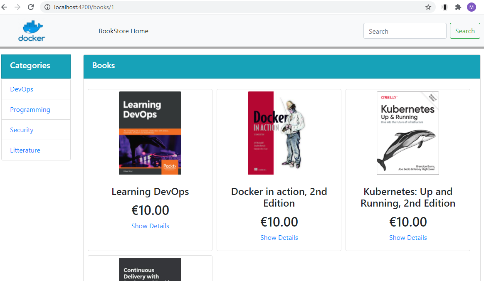

# Lab 05- Docker Compose
---


### Lab Steps
- [Step 1. A simple stack composed of a MySQL Container](#step-1-a-simple-stack-composed-of-a-mysql-container)
  - [Task 1 - Edit the docker-compose file for MySQL](#task-1---edit-the-docker-compose-file-for-mysql)
  - [Task 2 - Start the stack and inspect the service](#task-2---start-the-stack-and-inspect-the-service)
  - [Task 3 - Externalize the environment variables](#task-3---externalize-the-environment-variables)
- [Step 2. A stack composed of a Spring Boot Microservice and a MySQL Container](#step-2-a-stack-composed-of-a-spring-boot-microservice-and-a-mysql-container)
  - [Task 1 - Define the Docker Compose Services](#task-1---define-the-docker-compose-services)
  - [Task 2 - Update the Spring Boot Connection URL to MySQL](#task-2---update-the-spring-boot-connection-url-to-mysql)
  - [Task 3 - Build, Run and Test](#task-3---build-run-and-test)
- [Step 3 - A full-stack composed of an Angular web application, a Spring Boot Microservice and a MySQL Container](#step-3---a-full-stack-composed-of-an-angular-web-application-a-spring-boot-microservice-and-a-mysql-container)
  - [Task 1 - Walk through the starter project](#task-1---walk-through-the-starter-project)
  - [Task 2 - Add the Docker Compose artifacts](#task-2---add-the-docker-compose-artifacts)
  - [Task 3 - Build and Run the stack](#task-3---build-and-run-the-stack)
  - [Task 4 - Test the application and shutdown the stack](#task-4---test-the-application-and-shutdown-the-stack)

<div style="page-break-after: always"></div>


# Step 1. A simple stack composed of a MySQL Container 
With Docker Compose, we get all the benefits of Docker plus more. Docker works by creating a virtual environment(or container) for your code to run. What Docker Compose adds is orchestration and organization of multiple containers. While this step will only spin up a single container for our MySQL instance, Docker Compose can also be used to run all of your various services at once when your project begins to grow out. 

## Task 1 - Edit the docker-compose file for MySQL

- Start VS Code and open the folder `lab-05-step-1-compose-mysql-start`. Ensure that the Docker Compose for Visual Studio is installed, otherwise install it.
    > **How to install VS Code plugin ?** Click on `Extensions` icon from the left dark band. Then, type in `Compose` for example in order to look for the available Compose extensions. Select the one named `Docker Compose` and click on install. VS Code will install it without restarting.  

- Create a `docker-compose.yml` using the VS Code extension.  Type in `CTRL-SHIFT-P` then select `Docker: Add Docker Compose files to workspace`. Initialize the docker-compose file with the following content.

    ```yaml
    version: '3'
    services:
      my-myql-service:
        image: mysql:8.0
        restart: always
        environment:
          MYSQL_DATABASE: 'db'
          # So you don't have to use root, but you can if you like
          MYSQL_USER: 'user'
          # You can use whatever password you like
          MYSQL_PASSWORD: 'password'
          # Password for root access
          MYSQL_ROOT_PASSWORD: 'password'
        ports:
          # <Port exposed> : < MySQL Port running inside container>
          - '33066:3306'
        expose:
          # Opens port 3306 on the container
          - '3306'
          # Where our data will be persisted
        volumes:
          - my-db:/var/lib/mysql
    # Names our volume
    volumes:
      # Just specify a path and let the Engine create a volume
      # If you wan a bind mount volume, specify an absolute path mapping
      #   /path/to/folder:my-db (the referenced folder to be created beforehand)
      my-db:
    ```
This file configures the image, the credentials, and the volumes for the MySQL Container.

## Task 2 - Start the stack and inspect the service

- To start the Docker compose stack, run the following command:

    ```
    docker-compose up
    ```
 
- Check the running containers using the command: 

    ```
    docker ps
    ```

- Inspect the container and check that it has assigned the right values for the volume and credentials. Check the networking attributes of the container.  

    ```
    docker inspect [ContainerID  or Name]
    ``` 

- Hop in the container and lauch the mysql client and list the content of the database.  

    ```
    docker exec  -it [ContainerID  or Name] bash
    ``` 
    Within the container shell, type in the following command and give the password when asked: 
    ```
    # mysql -u root 
    ```  
     Within the mysql prompt, type in the following command to list the databases. You will see the db database there. 
    ```
    > show databases; 
    ```  
- Shutdown the stack using the command. It is possible to shutdown the stack by typing `CTL-C` in the console of the stack. 
    ```
    docker-compose down
    ```   
## Task 3 - Externalize the environment variables

- Create a file named `.env` in the project folder. Initialize it as follows

    ```shell
    MYSQL_DATABASE=db
    MYSQL_USER=user
    MYSQL_PASSWORD=password
    MYSQL_ROOT_PASSWORD=password
    ```
- Update the `docker-compose.yml` file in order to remove the hard-coded values of the environment variables. In our case, we will just remove the hard coded values since the names of the definition and the refence are the same. If the names are different, interpolation expressions `${var}` should be used in the yaml. have the same name in their definition and their reference in the yaml file. Environment variables can be configured with your SHELL (or system variables) or .env file. SHELL definitions have the priority over `.env`. 

- Restart the stack and check that the environment varibales are correctly get injected in the container.
_Question_ : How do you think about the versionning of `.env` file on GitHub for example ?  

# Step 2. A stack composed of a Spring Boot Microservice and a MySQL Container

In this step, we build a application stack composed of Spring Microservice exposing a simple Web API over a MySQL Database. We have already developped this application in `Lab08, Step 03`. The goal here is to refactor the application to take benefits of Docker Compose.

## Task 1 - Define the Docker Compose Services

- Start VS Code and open the starter folder `lab-05-step-2-compose-springboot-mysql-start`. Add the docker-compose.yml file and initialize it as follows.
    ```yaml
    version: '3'
    services:
      my-mysql-service:
          image: mysql:8.0      
          restart: always
          environment:
            MYSQL_DATABASE: 
            MYSQL_USER: 
            MYSQL_PASSWORD: 
            MYSQL_ROOT_PASSWORD: 
          ports:       
            - '33066:3306'
          networks:
            - spring-boot-mysql-network
        
      my-spring-service:
          build:
            context: ./
            dockerfile: Dockerfile
          ports:
            - '8080:8080'
          networks:
            - spring-boot-mysql-network
          depends_on:
            - my-mysql-service
                
    networks:
      spring-boot-mysql-network:
        driver: bridge
    ```

The specification of MySQL service is similar to the specification made in the previous step. We are defining network of type bridge named `spring-boot-mysql-network`.  The bridge driver creates a private network internal to the host so containers on this network can communicate. The two services  `my-mysql-service` and `my-spring-service` will bind to will bind together with that network.


The `my-spring-service`, has a  build context defined as  ` ./`. This means that the image takes the root path of the application where the compose file is located. Additionnally, the image uses the `Dockerfile` from `./`. Container will run at `8080` port as tcp connection in docker environment, expose the `8080` tcp port to host access the service. It use the network named `sprint-boot-mysql-network`. It depends on `my-mysql-service` service, without it service or docker container will not build properly in docker environment.

- Add the a `.env` file to to include the definition of the environment variables. This file should be similar to the one used in the previous step.

## Task 2 - Update the Spring Boot Connection URL to MySQL

- Open the the Spring Boot `application.properties` file which located under `src/main/resources` and change the spring datasource URL, username and password as follows.   
    ```
    spring.datasource.url=jdbc:mysql://my-mysql-service:3306/DockerProductsDB?createDatabaseIfNotExist=true
    spring.datasource.username=root
    spring.datasource.password=password
    ```
The microservice is using now the name of the MySQL service (`my-mysql-service`) which is defined in `docker-compose.yml`.  
    ```yaml
    version: '3'
    services:
      my-mysql-service:
          image: mysql:8.0 
          ...
    ```
## Task 3 - Build, Run and Test
- Build the stack using the following command. Check if there any build errors and fix them. 
    ```
    docker-compose build 
    ```   
- Start the stack using the command. It is possible to build and start in the same command : `docker-compose up --build`.

    ```
    docker-compose up 
    ```   

- Open a new teminal window and test the endpoint of the spring microservice using the `curl` utility. Test the GET Endpoint to get the list of the product using the following curl command.

    ```shell
    curl.exe -X GET http://localhost:8080/products 
    ```
- Shutdown the stack using the command. It is possible to shutdown the stack by typing `CTL-C` in the Docker Compose console of the stack. 
    ```
    docker-compose down
    ```   

# Step 3 - A full-stack composed of an Angular web application, a Spring Boot Microservice and a MySQL Container

## Task 1 - Walk through the starter project
- Navigate to the full stack project folder `lab-05-step-3-compose-angular-springboot-mysql-start` and explore its content. Notice the this folder contains two subfolders :
   - A subfolder named `backend-springboot-mysql` dedicated to the backend tier. It is essentially the project developped in the previous step. It contains a `Dockerfile`. 
   - A subfolder named `frontend-angular` dedicated to the frontend tier. This subfolder contains the Angular web application and it contains its own `Dockerfile`. 

Notice that we have activated the `CORS` filter in the Spring Boot REST controller using the `@CrossOrigin` annotation 

## Task 2 - Add the Docker Compose artifacts

- Add the `docker-desktop.yml` file to the main project folder.  `lab-05-step-3-compose-angular-springboot-mysql-start`. 

```yaml
version: '3'
services:
   my-mysql-service:
      image: mysql:8.0      
      restart: always
      environment:
        MYSQL_DATABASE: 
        MYSQL_USER: 
        MYSQL_PASSWORD: 
        MYSQL_ROOT_PASSWORD: 
      ports:       
        - '33066:3306'
      networks:
        - backend-network
    
   my-spring-service:
      build:
        context: backend-springboot-mysql
        dockerfile: Dockerfile
      ports:
        - '8080:8080'
      networks:
        - backend-network
        - frontend-network  
      depends_on:
        - my-mysql-service
  
   my-angular:
      build:
        context: frontend-angular
        dockerfile: Dockerfile
      ports: 
        - '4200:80'
      depends_on:
        - my-spring-service
      networks:
        - frontend-network       
networks:
  backend-network:
  frontend-network:
```
In the `build` attribute of each service, we specify the related folder as a build context and give the name of the dockefile in that context. We define two networks : one for bridging the spring micro-service with the MySQL Database and the other for bridging the microservice with the Angular front-end application.

- Add the `.env` file to the main project folder. It is the same as in the previous step. Add also the `.dockerignorefile`. Adding the `.dockerignore` file is necessary to avid the explosion of the size of the context mainly in the angular projet having a `node_modules` of about 250 Mega bytes !

## Task 3 - Build and Run the stack
- Build the stack using the following command. Check if there any build errors and fix them. 
    ```
    docker-compose build 
    ```   
- Start the stack using the command. It is possible to build and start in the same command : `docker-compose up --build`.

    ```
    docker-compose up -d
    ```   

Verify that Docker compose starts the three services in the right order. The log should look like the following.

```
Starting lab-05-step-3-compose-angular-springboot-mysql_my-mysql-service_1  ... done
Starting lab-05-step-3-compose-angular-springboot-mysql_my-spring-service_1 ... done
Recreating lab-05-step-3-compose-angular-springboot-mysql_my-angular_1      ... done
my-mysql-service_1   | 2020-05-10 18:10:01+00:00 [Note] [Entrypoint]: Entrypoint script for MySQL Server 8.0.20-1debian10 started.
my-mysql-service_1   | 2020-05-10 18:10:02+00:00 [Note] [Entrypoint]: Switching to dedicated user 'mysql'
my-mysql-service_1   | 2020-05-10 18:10:02+00:00 [Note] [Entrypoint]: Entrypoint script for MySQL Server 8.0.20-1debian10 started.
... Other lines stripped here
my-spring-service_1  |
my-spring-service_1  |   .   ____          _            __ _ _
my-spring-service_1  |  /\\ / ___'_ __ _ _(_)_ __  __ _ \ \ \ \
my-spring-service_1  | ( ( )\___ | '_ | '_| | '_ \/ _` | \ \ \ \
my-spring-service_1  |  \\/  ___)| |_)| | | | | || (_| |  ) ) ) )
my-spring-service_1  |   '  |____| .__|_| |_|_| |_\__, | / / / /
my-spring-service_1  |  =========|_|==============|___/=/_/_/_/
my-spring-service_1  |  :: Spring Boot ::        (v2.2.6.RELEASE)
... Other lines stripped here
my-angular_1         | 172.23.0.1 - - [10/May/2020:18:11:19 +0000] "GET / HTTP/1.1" 200 872 "-" "Mozilla/5.0 (Windows NT 10.0; Win64; x64) AppleWebKit/537.36 (KHTML, like Gecko) Chrome/81.0.4044.138 Safari/537.36" "-"
my-angular_1         | 172.23.0.1 - - [10/May/2020:18:11:20 +0000] "GET /favicon.ico HTTP/1.1" 200 948 "http://localhost:4200/" "Mozilla/5.0 (Windows NT 10.0; Win64; x64) AppleWebKit/537.36 (KHTML, like Gecko) Chrome/81.0.4044.138 Safari/537.36" "-"
my-angular_1         | 172.23.0.1 - - [10/May/2020:18:11:22 +0000] "GET / HTTP/1.1" 304 0 "-" "Mozilla/5.0 (Windows NT 10.0; Win64; x64) AppleWebKit/537.36 (KHTML, like Gecko) Chrome/81.0.4044.138 Safari/537.36" "-"
```

## Task 4 - Test the application and shutdown the stack

- To test to full stack, launch your browser and open the location `http://localhost:4200`. You will normally get the following UI.
 

- Shutdown the stack using the command. It is possible to shutdown the stack by typing `CTL-C` in the Docker Compose console of the stack. 
    ```
    docker-compose down
    ```   
    